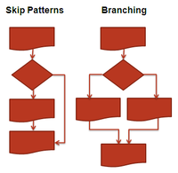
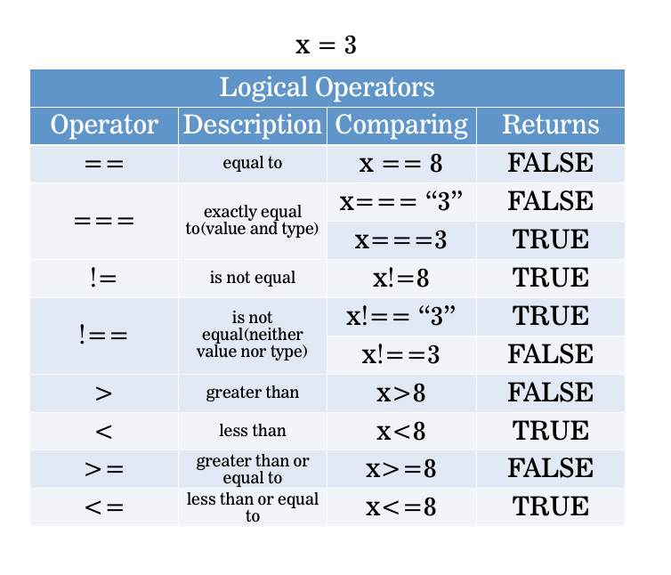

#FEWD - Variables and Conditionals

###Lesson 9 - Mar 7, 2016

"To be is to be the value of a bound variable." - <a href="https://en.wikipedia.org/wiki/Willard_Van_Orman_Quine">Willard Van Orman Quine</a>, "On What There Is" (1948)

---

##Agenda

*	Reivew
*	Debugging with console
*	Variables
*	Conditionals
*	Lab Time

---

##Exit tickets

*	Since JQuery is so much more useful and convenient, do we even need study more about Javascript?

Answer: Yes, we absolutely do.  jQuery is just a **library**, so we will use it in addition to JavaScript to create full programs.  Tonight, we'll learn a few things about JavaScript itself!

*	How do you time functions?

Answer: <a href="http://www.w3schools.com/jsref/met_win_settimeout.asp">setTimeout</a> - will cover in detail next class

*	Will jQuery play a big role in developing web apps. 

Answer: For front-end only apps, yes!  For full-stack apps, jQuery can still play a big role but a lot of web developers are shifting to using frameworks like Angular or React for full-stack interactivity.  But the concepts behind jQuery will still apply.

---

##Exit tickets

*	Would it be able to style a webpage without css and only jquery?

Answer:	Yes, though this one falls into the "just because you *can* doesn't mean you *should*" camp.

*	what is a handler? what is a DOM in reference to jQuery? what is a DOM asset? DOM element?

Answer: **handler** is the **function** that you tell JavaScript to run *after* an event is detected. [See the "jQuery Events" section from <a href="../../Week_04_Intro_Programming/08_Intro_jQuery/slides.md">Lesson 8</a>]

The **DOM** in reference to jQuery is the same DOM that we've been working with previously - now we are using **selectors** to access and perform manipulations on **DOM elements** (elements created in HTML).

*	can you use jquery and javascript at the same time, in the same file? how do developers create new rules for jQuery?

Answer: Yes!  And developers write new updates to the jQuery codebase using normal "vanilla" JavaScript.

---

##Review

<a href="../../Week_04_Intro_Programming/Assignment/solution_code">Solution for Assignment 4.</a>

---

##Console

Just as we could interact with our HTML & CSS using Chrome DevTools Inspector, we can also interact with our JS.  This area appears in Chrome DevTools under "Console".

Things can appear in this area in two ways:

1.	Directly inputting into the Chrome DevTools console.
2.	Using the method `console.log()` in our JavaScript code with the values we want to display.

---

##Variables

What are variables?

---

##Variables

*	We can tell our program to remember values for us to use later on. 

*	The action of saving a value to memory is called **assignment**

*	The entity we use to store the value is called a **variable**

---

##Variables

*	The action of getting the value from a variable is called **accessing** the variable

*	We will use all the above techniques to store values into variables, and generate new values using existing variables

---

##Variables Declaration

Declaration: `var age;`

Assignment: `age = 21;`  (**NOTE**: you should not do this unless you have already declared the variable)

Both at the same time: `var age = 21;`

---

##Variable Re-Assignment

`var name = "Jo";`

`name = "Amir";`

Note:

name is now Amir.

---

##Variable Conventions

*	Variables start with a lower case letter

*	If they contain multiple words, subsequent words start with an upper case letter (this is called **camelCasing**).

		var numberOfStudents = 10;

---

##Variables & Data Types 

What can you store in a variables?

##Data Types

The types of different values we support *include* (but are not limited to):
	
*	__String__ text
*	__Number__ numbers
*	__Boolean__ true or false

---

##Score Keeper

---

##Strings

*	Stores textual information
*	String literal is surrounded by quotes (single and double both work)

`"How is the weather today?"`

`'Warm'`

---

##Strings

Double vs single quoted strings:

'They "purchased" it'

"It's a beautiful day"

---

##Conversion: String To Number

	var intString = "4";
	var intNumber = Number(intString);
	var floatString = "3.14159";
	var floatNumber = Number(floatString);
	

**Why would you need to convert datatypes?**

The most common usecase for datatype conversion is when you are reading in user input and need to process it.  All data inputted via a form by the user will be received as a String (even numerical input); if we want to take the number input via the form and so some math with it, however, JavaScript will need to receive that input as a Number (not a String).  This is where **type conversion** comes in handy.

---

##Conversion: Number To String

	var number = 4;
	var stringNumber = String(number);

---

##Numbers

Represent numerical data

whole integer:         42

float with decimal:      3.14159265

---

##Numbers

Signed

int:         +6

float:      -8.2

Can perform arithmetic on number data types

---

##Arithmetic In JavaScript

---

##Conditionals

---

##Making Decisions

It's either TRUE or FALSE

If you are greater than 18, (then) 
you are an adult

	if (age > 18){
		document.write("You are an adult");
	}

---

##Compare That

---

##Comparisons - Equality

Are two things equal?

	10 === 10 //true
	10 === 5 //false
	"hi" === "hi" //true

---

##Comparisons - `==` vs `===`

`==` will perform **type coercion** so that equality may hold between two expressions that with **type coercion** will evaluate to the same value

`===` performs **NO** type coercion, and is therefore the stricter of the two equality comparisons

	3 == "3" // ==> true
	3 === "3" // ==> false

**RULE OF THUMB**: use `===` when in doubt; this will guarantee that you are not matching for false equivalences

---

##Logical Operators

---

##Conditional Syntax

	if (condition is true) {  
		//Do cool stuff
	}

---

##Conditional Syntax

	if (condition is true) {
		//Do cool stuff
	}
	else {
		//Do other cool stuff
	}	

---

##Conditional Syntax

	var topic = "JS";
	if (topic === "JS") {
		console.log("You're learning JavaScript");
	}
	else if (topic === "JavaScript") {
		console.log("You're still learning JavaScript");
	}
	else {
		console.log("You're learning something else");
	}

---

##Multiple Conditions

###We can combine conditions to check if multiple things hold.

`&&` - **AND** : **ALL** things must be true

	if (name === "GA"  && password === "YellowPencil"){
		//Allow access to internet
	}

`||` - **OR** : **AT LEAST ONE** must be true

	if (day === "Monday"  || day === "Wednesday"){
		//We have class today
	}

---

##Blackout

---

##Temperature Converter

We will be coding a Temperature Converter app.

This app will:

*	Allow the user to input a temperature in Fahrenheit
*	Reveal the corresponding temperature in Celsius

In groups of 2:

*	Write pseudocode for your application
*	Write the code to convert Fahrenheit into Celsius, and display the result in the browser.

---

##Homework

*	If you haven't sent us your Final Project Proposal -- please do!
*	Read Shay Howe's overview of <a href="http://learn.shayhowe.com/advanced-html-css/jquery/">jQuery</a>

---

##Exit Tickets - Lesson #9, Topic: Variables and Conditionals

###Please fill out the <a href="https://docs.google.com/forms/d/1Iw2zghHfGgeM1p1G16F6kLi7KViv28tG3HVNnoM3PAc/viewform">exit ticket</a> before you leave
