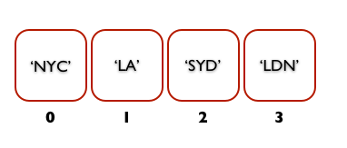

#FEWD - Refactor, this, and arrays

###Lesson 12 - Mar 16, 2016

---

##Agenda

*	Exit tickets
*	Refactor
	*	`this`
	*	Traversing the DOM
	*	Relaxr blog refactor code-a-long
*	Arrays
*	Homework, etc.

---

##Exit Tickets
*	I noticed that during our class' code along, Emma used "$("body").removeClass("nyc sf la austin sydney");" to switch the background images around, but in the solution code, they created a function resetBody();. Which way is the recommended way for instances like this?

Answer: When possibly, make your code *modular* by creating functions that handle specific tasks.  We will talk tonight about how this relates to **refactoring** your code.  [But in practice, these two things do exactly the same thing.]

*	How often do you write codes with variables? Is it an industry standard and are there any other options for comparisons?

Answer: This also makes your code more *modular* and therefore more maintable in the long term.  The industry standard is to make things as modular as possible whenever you can; you can never overdo it with variables!

For reference, in the `Compare That` code-a-long from Lesson 9, we could have done without variables by re-using the same code that fetches the input boxes' values within the conditionals.  But notice that this makes the code much harder to read, and much more prone to errors.

---

##Exit Tickets

*	why can't console debug itself if it knows what the issue is!? 

Answer: `console` can detect syntax errors, but usually doesn't know how to resolve those errors.  This is because `console` detects errors based on what the JavaScript language necessitates syntactically, but how those errors came to be (and how they need to be resolved) is not always readily apparent.

Compare this to syntax errors in English.  If I say `I be happy`, it's clear there was a syntax error with the verb, but how it should be conjugated to preserve the meaning I intended isn't clear (I might have meant past tense, present, future, etc).

*	basic order of the js page. do you first write the click function....is that usually first or just in our examples. what happens if you have a nav, does that js come first?

Answer: JavaScript executes from top-to-bottom.  However, with click functions (and other event handlers), JavaScript will not executer the handler until *after* the event is triggered (which is why it doesn't matter what order the event handling functions occur).  In our examples in class, we create the click listener (`.click`) *before* defining the event handler -- this is just to make the code easier to follow/read.

---

##Exit Tickets

*	After getting more familiar with javascript, what would be the next more accessible language?

Answer: Really depends on what you're interested in doing next!  Most of the concepts in JavaScript (conditionals, strings, numbers, arrays, iteration over arrays) are also present in other languages, just implemented differently.  Ruby and Python (both popular for backend development) are two really good languages that share a lot in common with JS.

---

##Refactor

The process of rewriting code without changing functionality

*	To reduce or eliminate redundancy
*	Make code easier to read
*	Make code more maintainable

---

##JS Refactor

*	Use functions (instead of giant blocks of code)
*	Use variables (instead of hardcoding or repeating values)
*	Use arrays (instead of hardcoding multiple values)
*	Use programmatic behavior (instead of repeating yourself)

---

##Refactor - Relaxr blog

---

##Keyword: "This"

jQuery: “this” refers to the selected object

---

##This

`this` is great for when you want to assign an event handler for many different elements, but want them all to be handled the same way

	
	$("p").click(clickHandler);
	function clickHandler() {
	    $(this).fadeOut(500);
	}

Rule of thumb (ROT): If I don’t know what thing will be acted on, then I should consider using `this`

---

##Refactor - Relaxr blog

---

##FAQ Refactor

---

##Arrays

What if we had a collection of images that we wanted to display to the screen one at a time? 

How could we store all the images? 

---

##Declaring Arrays

`var myArr = new Array();`

*	declaring an empty array using the Array constructor.

OR

`var myArr = [ ];`

*	declaring an empty array using literal notation.

**NOTE**: Both ways are valid ways to create Arrays.  The notational convention is to create an array with `[]` (second option).

	
---

##Filling Arrays

`myArr = ['Hello', 54.3, true];`

*	Arrays are filled with elements: i.e. `myArr3 = [element, anotherElement];`
*	Elements can contain strings, numbers, booleans, and more.
*	Arrays may be filled with elements of different types.	

---

##Arrays Indexing

**NOTE** JavaScript starts counting from **0**.  This is called *zero-indexing*.  (This is a common programming language construct.)

---

##Arrays Indexing

Array elements can be fetched by their index number (starts from 0).

	myArr = ['Hello', 'world' , 54.3, true];

	console.log(myArr[0]); //prints Hello
	console.log(myArr[1]); //prints undefined
	console.log(myArr[2]); //prints 54.3
	console.log(myArr[3]); //prints true
	
---

##Arrays Indexing

We can insert new values into any space in the array using the positions index.

	myArr[1] = 'Stuff';

---

##Arrays Indexing

We can overwrite all the elements of an array simply by giving the array new values or by setting an array equal to a different array.
	
	var fruits = ['Apples', 'Oranges', 'Pears', 'Bananas'];
	var myArr=[1,2,3];
	myArr = fruits;
	
	console.log(myArr); //prints Apples, Oranges, Pears, Bananas

---

##Array Length

What if I would like to know how long my array is (how many elements)?
	
	console.log(myArr.length); //prints 4

---

##Iterate Over Array

Allows you to run code using each element from the array as a value

Syntax:

	Array.forEach

---

##Iterate Over Array

	var fruits = [“Banana”,”Apple”,”Pear”];
	fruits.forEach(function(element,index){
		console.log(element,index);
	});

*	Element is the item from the array
*	Index is the item’s position in the array
*	As always, code we want to execute goes between curly braces

---

##Iterate Over Array

**NOTE**: You may sometimes see an alternative notation for iterating over an array:

	var fruits = [“Banana”,”Apple”,”Pear”];
	for (var i = 0; i < fruits.length; i++) {
		console.log(fruits[i], i);
	}

This is equivalent to using `forEach` as we just saw, but it has the ability to give more control over the way JavaScript will loop over the array.  For now we will use `forEach`, but just wanted to mention this in case you see this in your continued explorations of JS.

---

##For Each

---

##Carousel

---

##Homework 

*	Assignment #6 - Rock Paper Scissors!
*	Work on the HTML + CSS for your Final Project

---

##Exit Tickets - Lesson #12, Topic: Refactor, this, and Arrays

###Please fill out the <a href="https://docs.google.com/forms/d/1Iw2zghHfGgeM1p1G16F6kLi7KViv28tG3HVNnoM3PAc/viewform">exit ticket</a> before you leave