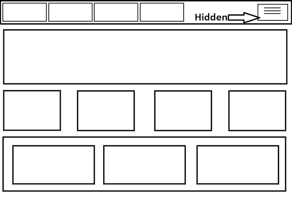
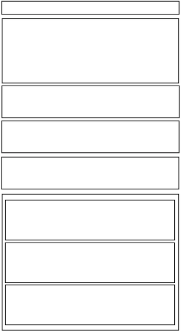

#FEWD - Responsive Basics 

###Lesson 13 - Mar 21, 2016

"We rise and we fall / And we break" - Leslie Odom Jr. as Aaron Burr, clearly embodying the spirit of responsive web design

---

##Agenda

*	Exit Tickets
*	HTML/CSS Review
*	Responsive Layouts
*	REM/EM
*	Media Queries

---

##Annoucement

###Emma won't be holding office hours next week 3/29 or the following week 4/5.  Please Slack or email me to set up a time to meet. 

---

##Exit tickets

*	For something with a super large list of items , like a word list,  do we need to move on to something more accommodating than arrays? 

Answer: For a very large list of items, usually, this data comes from some backend service.

*	`images.length -1;` in Food Carousel code-a-long

Answer: Let's review together! 

---
##HTML/CSS Review

Let's bring HTML/CSS back into the equation.

---

##Boxes

You have 20 minutes to recreate this layout:

---

#Responsive Layout

---

##What is Responsive Design?

In the early days of the web, there was just one way that people accessed webpages: through a computer.  You could design and implement a site that had a main container width of about 980px and be sure that most users would see the same exact thing.

---

##A layout for every screen size

Responsive Design emerged as a reaction to the growing diversity of screen sizes that users were viewing the web with.  

Making a website responsive is primarily a *design task*, but there are a few tools we'll use to implement these responsive designs.

---

## Common responsive design patterns

*	Mobile nav ("hamburger" nav)
*	Columns stack after certain point (for example, 3-column design ==> 3 vertically stacked elements at mobile screen breakpoint)
*	Paragraph font sizes increase for better readability
*	Title font sizes decrease to take up less space

---

##Mobile Boxes

You have 20 minutes to recreate this layout:

Add this at the **bottom** of the CSS for your previous code; yes, this will override your previous styles.  (Don't worry, we'll get there!)

---

##Fixed Layout

*	Relies on a container of fixed width

*	Usually 960px or 980px

---

##Responsive Layout

*	Different styles for different screen widths

*	Uses an elastic/fluid layout

*	Sized in percentages

*	Sized in ems

---

##EMs

* Sized based on the width of the letter “m” by browser default (16px)
* 1em=100% of default font-size
* Based on parent

[http://alistapart.com/articles/howtosizetextincss](http://alistapart.com/articles/howtosizetextincss)

---

##EMs

	.parent {
		font-size: 16px;
	}
	
	.child {
		font-size: 2em;
	}

* Child’s font size is 32px

---
## EMs

A couple of tools to make your lives easier:

*	<a href="http://pxtoem.com/">PX to EM conversion</a>
*	<a href="http://type-scale.com/">Type Scale</a>

Advanced topic: <a href="https://j.eremy.net/confused-about-rem-and-em/">Em vs Rem</a>

---

#Media Queries

Media Queries allow us to selectively apply styles *only* when the browser hits a certain width/height (or *breakpoint*).

---

##Media Queries 

	.example-container {
		width: 25%;
		display: inline-block;
	}

	@media only screen and (max-width: 480px) {
	  .example-container {
	    width: 100%;
	  }
	}

<a href="https://css-tricks.com/snippets/css/media-queries-for-standard-devices/">List of common media queries and breakpoints</a>

---

##Media Queries in practice

---

##Media Queries

	@media [specify devices] and [condition_1] and [condition_2]
	
	@media screen // For pages in a browser
	
	@media print // For printed pages
	
	@media only screen and	(min-width: 768px) and (max-width: 991px)
	
	@media only screen and	(orientation: portrait)
	
	@media only screen and	(orientation: landscape)

`only` in the queries above is used primarily to account for <a href="http://stackoverflow.com/questions/8549529/what-is-the-difference-between-screen-and-only-screen-in-media-queries">older broswers that don't support media queries</a>

Standard media queries sizes:

| Device size | Min | Max |
| ------------- |:-------------|:-------------------|
| Tiny | 0px | 479px |
| Small | 480px | 767px |
| Medium | 768px | 977px |
| Large | 978px | ∞ |

---

##Media Queries 

`max-width` vs `max-device-width`

`max-width` refers to maximum width of the browser window

`max-device-width` refers to maximum width of the device itself

Use `max-width` if you want your responsive styles to render not just on a particular device but also when the web browser within a larger screen is resized.

---

##Mobile Display

Often when a phone browser renders a website, it tries to render it at full size (980px). Then, the user can zoom into areas of interest.

We want to make sure that the phone browser renders our page at the pixel width of the device. If a mobile phone is 420px wide, we want it to render our webpage at a width of 420px.

Here's the `<meta>` tag that let's us do that:

	<meta name="viewport" content="width=device-width, initial-scale=1">
	
Optionally, disable user zooming (generally discouraged):

	<meta name="viewport" content="width=device-width, initial-scale=1, user-scalable=none">

---

##Order matters

	.example-container {
		width: 25%;
		display: inline-block;
	}

	@media only screen and (max-width: 480px) {
	  .example-container {
	    width: 100%;
	  }
	}
	
If I put the media query first, will this work as expected?

---

##Responsive Boxes

Using media queries, alter the code from the Mobile Boxes Lab so that your mobile styles only apply after a breakpoint of **768px**.

---

##Exit Tickets - Lesson #13, Topic: Responsive Basics

###Please fill out the <a href="https://docs.google.com/forms/d/1Iw2zghHfGgeM1p1G16F6kLi7KViv28tG3HVNnoM3PAc/viewform">exit ticket</a> before you leave