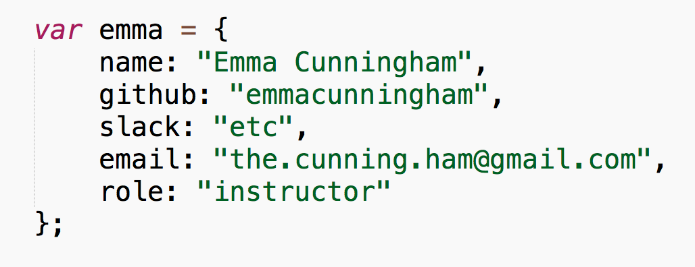

#FEWD - Objects and Data

###Lesson 15 - Mar 28, 2016

---

##Announcement

###Reminder: No office hours Tuesday this week. Sam will be holding office hours before class on Wednesday 6-7pm.  

---

##Agenda

*	Exit Tickets
*	Responsive Design review
*	Objects in JavaScript
*	Using objects 
*	Working with external data sources
*	API Code-a-long

---

## Exit Tickets 

*	Can you go over the matchmaker assignment from class?

Answer: Yes!

---
## Review Startup Matchmaker Lab

---
## Objects in JavaScript

###What is an object?
* Objects are a type of **data structure** that is nearly universal across programming languages, although they may have different names in different languages
* Like arrays, objects can hold multiple pieces of data of varying types; but *unlike arrays*, objects use named **keys** rather than indices to order and access those pieces of data
* Objects in general are made up of two things – **properties** and **methods**. Properties are data attached to an object that describe it or are related to it in some way. Methods are just functions, but because they're attached to an object, you can think of them as actions that the object can invoke on itself (today we will just be using properties)

**Example**: In this class, there are certain data that we care about for all individuals in this class: name, email, Slack username, GitHub username, role type (student or instructor).

*Note*: Everything in JavaScript is an object.

---
## Creating objects 

There are several ways to create an object in JavaScript.  For the sake of this introduction, we will introduce one method, creating an **object literal**.

[Those of you who are interested in learning the other ways you can create an object: check out the Code Academy lesson on <a href="https://www.codecademy.com/courses/spencer-sandbox/0/1">objects</a>.]

---
## Creating objects 

The object above has five properties: `name`, `github`, `slack`, `email`, and `role`.

Note: We could have just created the object, but of course part of the purpose of an object is to be able to refer to it later -- this is why we assign the object to a variable (in this case named `emma`).

---
## Using objects - accessing values

---
## Using objects - editing values

[Note: the above is very similar to how we have been reassigning values for *variables*.]

---
## Using objects with the DOM

---

## Using objects - looping through an array of objects

---
## Better sources for data: APIs

We've just seen that the combination of objects and arrays can be rather powerful, allowing us to manipulate and display many objects with data at once.

But, you may have noticed that we were working with our own data, which had to be typed out by hand (this is often called *hardcoding* your data).  In the real world, we'd want to connect to a service that can handle the data part for us.

This is where an API comes along.

---
## What is an API?

###API = Application Program Interface

An API is a set of code and data that allows you to interact with another program/service, often with the intenton of allowing you to incorporate aspects of the program/service within your own app.

For example, Instagram is a service that allows users to upload images and view/interact with the images of others.  The Instagram API contains a set of protocols that allow you to use this data within your own app.

Caveat: many APIs are intended to be used from the server side of an application because of security reasons.  While using these kinds of APIs falls outside of the scope of what we can cover in our front-end class, we will use APIs that are intended for *client-side* consumption.

---
## Consuming an API

We will need:

*	A URL that will allow us to fetch data
*	jQuery's `$.get()` method

---

## API Codealong: Movies

We will use the <a href="http://www.omdbapi.com/">OMDb API</a> to fetch the top 10 results for a given term.

The search URL we will use is: `http://www.omdbapi.com/?s=`

Let's try it out in our browsers first.

---
##Resources

*	<a href="https://www.codecademy.com/courses/spencer-sandbox/0/1">Code Academy Intro to Objects</a>
- [Objects in Javascript](https://developer.mozilla.org/en-US/docs/Web/JavaScript/Guide/Working_with_Objects)

---

##Exit Tickets - Lesson #15, Topic: Objects and Data

###Please fill out the <a href="https://docs.google.com/forms/d/1Iw2zghHfGgeM1p1G16F6kLi7KViv28tG3HVNnoM3PAc/viewform">exit ticket</a> before you leave