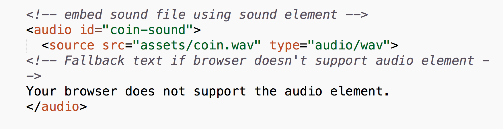
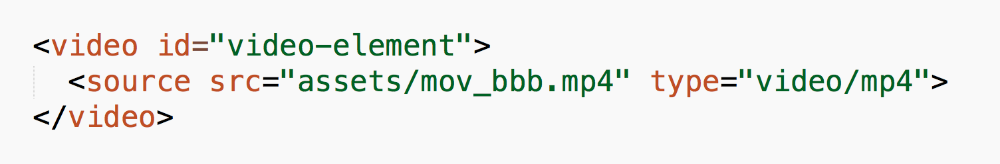

#FEWD - Embedded content and third-party tools

###Lesson 16 - Mar 30, 2016

 

---

##Agenda

*	Exit Tickets
*	Embedding content - iframes
*	Embedding content - HTML5 native methods
*	Embedding content - using a third-party API
*	Third-party tools 

---

## Exit Tickets 

*	elements/index in arrays

*	How do you pull from multiple APIs?

---
## Embedding content - iframes

If you need to embed content from another site (YouTube, Soundcloud, etc.), most third-party app providers offer **embed code**; you'll realize that usually this embed code looks like HTML!

<a href="http://www.w3schools.com/tags/tag_iframe.asp">iframes - W3Schools documentation</a>

---
## iframe, youframe, we all scream for...

`iframe` is an HTML tag that allows you to embed any other site's content within your own site

Because `iframes` are simply just another kind of HTML element, you can also style your `iframes` with CSS.

---
## Embedding content - HTML5 native methods

Sometimes embedding content from another site like YouTube or SoundCloud would be insufficient.  You may not want to host the files online through a third party, or you may want to do something entirely different.

---

## Embedding content - `audio` element

We can directly embed audio files onto our pages with the `audio` element.

*	<a href="http://www.w3schools.com/html/html5_audio.asp">audio - W3Schools documentation</a>
*	<a href="http://codesamplez.com/programming/control-html5-audio-with-jquery">Control HTML5 Audio With Jquery</a>

---

## Embedding content - `audio` element

---

## Embedding content - `audio` element

Common media types:

*	mp3
*	wav
*	ogg 

---
## Embedding content - `video` element

We can directly embed audio files onto our pages with the `video` element.

*	<a href="http://www.w3schools.com/html/html5_video.asp
">video - W3Schools documentation</a>

---
## Embedding content - `video` element

---

## Embedding content - `video` element

Common media types:

*	webm
*	mp4
*	ogg 

---

##Embedding content - Google Maps

*	<a href="https://developers.google.com/maps/documentation/javascript/">Google Maps API documentation</a>

---

##Styling maps

*	<a href="http://googlemaps.github.io/js-samples/styledmaps/wizard/index.html">Google Maps styling wizard</a>
*	<a href="https://developers.google.com/maps/documentation/javascript/examples/maptype-styled-simple">Example of simply styled map</a>
*	<a href="https://developers.google.com/maps/documentation/javascript/styling#overview">Map styling options</a>
---

##Places autocomplete

*	<a href="https://developers.google.com/maps/documentation/javascript/examples/places-autocomplete">Google Maps Places Autocomplete API API</a>

---
## Third party plugins

Ok, so admittedly digging through the Google Maps documentation (and even some of the `audio` and `video` docs) can be a confusing endeavor, especially since a lot of times the documentation is written in vanilla JS only.

If only someone had made an easy-to-use set of functions that we could use with jQuery...

---
## jQuery plugin: Masonry

*	<a href="http://masonry.desandro.com/">Masonry documentation and source</a>

---
## jQuery plugin: Scrolling animation

*	<a href="https://github.com/Prinzhorn/skrollr">Skrollr</a>

---

##Resources

*	<a href="https://developer.mozilla.org/en-US/docs/Web/Guide/HTML/Using_HTML5_audio_and_video">Using HTML5 audio and video</a>
*	<a href="https://html5boilerplate.com/">HTML5 Boilerplate</a>
*	<a href="http://getbootstrap.com/">Twitter Bootstrap</a>
*	<a href="https://plugins.jquery.com/">jQuery plugins</a>

---
## Experimentation time

---

##Exit Tickets - Lesson #16, Topic: Embedded content and third-party tools

###Please fill out the <a href="https://docs.google.com/forms/d/1Iw2zghHfGgeM1p1G16F6kLi7KViv28tG3HVNnoM3PAc/viewform">exit ticket</a> before you leave