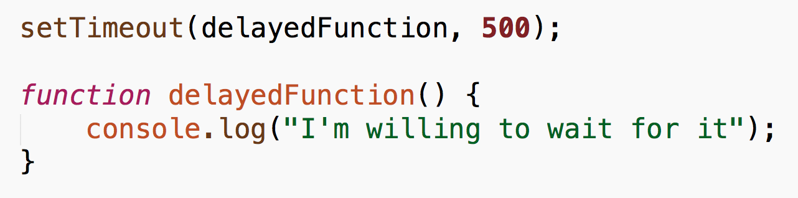
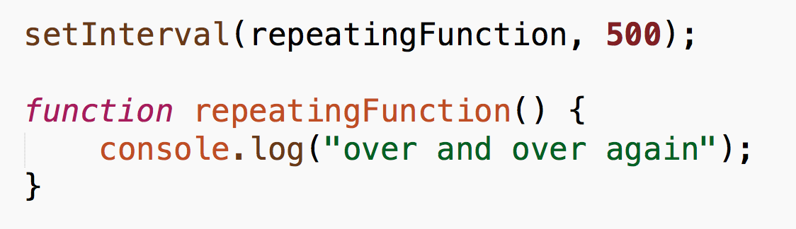

#FEWD - Time and Space

###Lesson 17 - Apr 4, 2016

 

---

##Agenda

*	Exit Tickets
*	Timing functions in JavaScript
*	Google Maps API
*	Preparing for the end 

---

## Exit Tickets 

*	Can you use plugins like Skrollr on pop ups after a link is clicked?

Answer: yes!  If you look at the documentation, you can use Skrollr functionality on anything that can be rendered as an HTML element -- including pop-ups!

*	Does everyone just use the plugin templates and features? OR is there value in generating your own design?

Answer: If you are building a product that has to scale, plugins &c. can add bloat to your stack, but for small-scall projects, it's perfectly fine to use additional modules and libraries.

*	Bootstrap has a carousel feature - is it better to use their plugin or use slick's carousel?

Answer: depends on your needs!  If you are satisfied with the features in Bootstrap's carousel, then you can stick with that, but if you want something with more flexibility, you may want to use another package.

---
##Timing functions in JavaScript

###We have seen how we can write code that delays the execution of a function until an event is triggered (for example, a click event), but how do we delay the execution of a function that we want to run after a certain amount of time?

---
## `setTimeout`- delays the execution of a function

---
## `setInterval` - repeats the execution of a function 

---
##Getting started with Google Maps

*	<a href="https://developers.google.com/maps/documentation/javascript/">Google Maps API documentation</a>

---

##Places autocomplete

*	<a href="https://developers.google.com/maps/documentation/javascript/examples/places-autocomplete">Google Maps Places Autocomplete API</a>

---

##Styling maps

*	<a href="https://snazzymaps.com">Snazzy Maps</a> - Styling wizard
*	<a href="https://developers.google.com/maps/documentation/javascript/examples/maptype-styled-simple">Example of simply styled map</a>
*	<a href="https://developers.google.com/maps/documentation/javascript/styling#overview">Map styling options</a>

---
## Preparing for the end... of this class!

*	<a href="https://help.github.com/articles/fork-a-repo/">Fork</a> our class repository
*	Keep learning!
	*	Meetups and networking events 
		*	<a href="http://www.meetup.com/la-fullstack/">Weekly Pair Programming meetup for beginners</a>
		*	<a href="js.la">JS.la</a> - monthly JavaScript meetup (good for networking)
		*	<a href="http://nodeschool.io/">Node School</a> - get started with backend JS 
		*	<a href="http://nodeschool.io/los-angeles/">LA Node School</a> - local meetup 
	*	<a href="http://exercism.io/">Exercism.io</a> - Command Line code exercises
	*	<a href="https://alexnisnevich.github.io/untrusted/">Untrusted.io</a> - JavaScript  game
*	<a href="http://shop.oreilly.com/product/9780596517748.do">JavaScript: the Good Parts</a>
*	Static Hosting
	*	<a href="http://www.sitepoint.com/how-to-choose-your-web-hosting-provider/">How to choose your web hosting provider</a>
	*	<a href="../../Week_00_GitHub/ghPages.pdf">GitHub Pages</a>

	

---

##Exit Tickets - Lesson #17, Topic: Time and Space

###Please fill out the <a href="https://docs.google.com/forms/d/1Iw2zghHfGgeM1p1G16F6kLi7KViv28tG3HVNnoM3PAc/viewform">exit ticket</a> before you leave